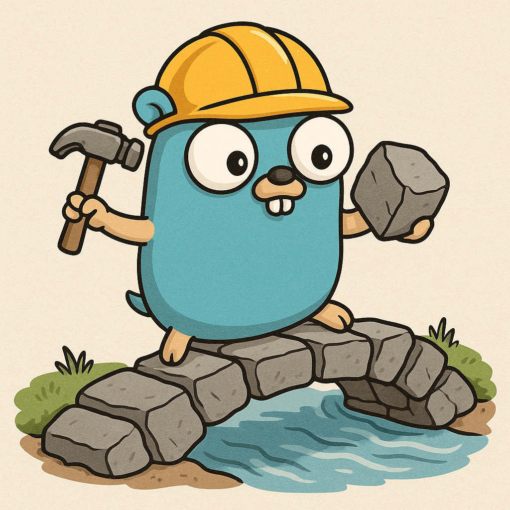
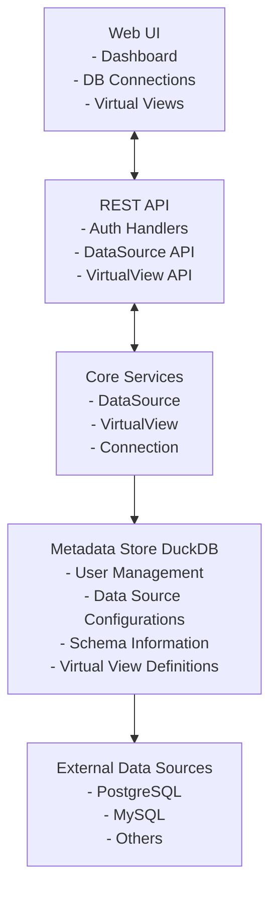

# Bridgo - Data Bridge With Go

[](https://golang.org/)
[](LICENSE)

**Bridgo** is a modern data virtualization platform that enables seamless access to multiple data sources without the need for data movement. Built with Go and powered by DuckDB as a metadata store, Bridgo provides a unified interface to query and manage data across different database systems.

## Features

### Core Capabilities
- **Multi-Database Connectivity**: Connect to PostgreSQL, MySQL, and other popular databases
- **Data Virtualization**: Access and query data from multiple sources without moving the data
- **Web Interface**: Intuitive web-based interface for easy access and management

## Architecture



## Prerequisites

- **Go 1.19+**
- **DuckDB** (automatically managed)
- **Access to target databases** (PostgreSQL, MySQL, etc.)

## Installation

### Quick Start

1. **Clone the repository:**
   ```bash
   git clone <repository-url>
   cd bridgo
   ```

2. **Install dependencies:**
   ```bash
   go mod tidy
   ```

3. **Build the application:**
   ```bash
   go build -o bin/bridgo cmd/app/main.go
   ```

4. **Run the application:**
   ```bash
   ./bin/bridgo
   ```

5. **Access the web interface:**
   Open your browser and navigate to `http://localhost:18080` or `your-server-ip:18080`

### Default Credentials

For development purposes, the following admin account is automatically created:
- **Username:** `admin`
- **Password:** `admin`

## Usage

### 1. Setting Up Data Sources

1. Navigate to **DB Connections** in the dashboard
2. Click **"Add New Connection"**
3. Fill in your database connection details:
   - **Source Name**: A friendly name for your connection
   - **Database Type**: PostgreSQL, MySQL, etc.
   - **Host & Port**: Database server details
   - **Credentials**: Username and password
4. Test the connection and save

### 2. Creating Virtual BaseViews

1. Go to **Virtual Views** section
2. Select a configured data source
3. Choose a table from the available schema
4. Select specific columns you want to include
5. Provide a name and description for your virtual view
6. Save the virtual BaseView

### 3. Querying Data

- **Schema Preview**: View column information, data types, and constraints
- **Sample Data**: Preview first 5 rows of data from your virtual views

## Troubleshooting
If you encounter issues:
- Ensure your internet browser using old cache. (Try clearing cache or using incognito mode)
- Manually delete local DuckDB metadata file if it becomes corrupted:
  ```bash
  rm -f ./bridgo_meta.db ./bridgo_meta.db.wal
  ```

## Database Support

Currently supported database systems:

| Database | Status | Features |
|----------|--------|----------|
| PostgreSQL | ✅ Full Support | Schema discovery, querying, virtual views |
| MySQL | ✅ Full Support | Schema discovery, querying, virtual views |
| Others | 🔄 Planned | Coming soon |

## Project Structure

```
bridgo/
├── cmd/app/                 # Application entry point
├── internal/
│   ├── auth/               # Authentication & JWT handling
│   ├── core/               # Core business logic services
│   ├── metadata/           # DuckDB metadata management
│   ├── models/             # Data models and structures
│   ├── server/             # HTTP server configuration
│   ├── users/              # User management service
│   └── web/                # HTTP handlers and routing
├── web/ui/                 # Frontend assets
│   ├── css/               # Stylesheets
│   ├── js/                # JavaScript modules
│   └── *.html             # HTML templates
├── go.mod                 # Go modules
└── README.md              # This file
```

## Development Status

This project is currently in **early development stage**. 

### Completed Features
- [x] Multi-database connectivity (PostgreSQL, MySQL)
- [x] Schema discovery and metadata storage
- [x] Virtual BaseView creation and management
- [x] Web-based dashboard interface
- [x] Sample data preview
- [x] Real-time connection testing

### In Progress
- [ ] Advanced virtual view combinations
- [ ] RESTful API endpoints
- [ ] Refactor codebase for better modularity

### Planned Features
- [ ] Support for more database types (SQLite, Oracle, SQL Server)
- [ ] Data transformation capabilities
- [ ] Scheduled data synchronization
- [ ] Role-based access control
- [ ] API rate limiting
- [ ] Docker containerization

## Contributing

welcome any contributions! If you have ideas for improvements or new features, please follow these steps:

1. Fork the repository
2. Create your feature branch (`git checkout -b feature/amazing-feature`)
3. Commit your changes (`git commit -m 'Add some amazing feature'`)
4. Push to the branch (`git push origin feature/amazing-feature`)
5. Open a Pull Request

## License

This project is licensed under the MIT License - see the [LICENSE](LICENSE) and [NOTICES](NOTICES) files for details.

## Support

If you encounter any issues or have questions:

1. Check the [Issues](https://github.com/Clyde0909/Bridgo/issues) page
2. Create a new issue with detailed information

---